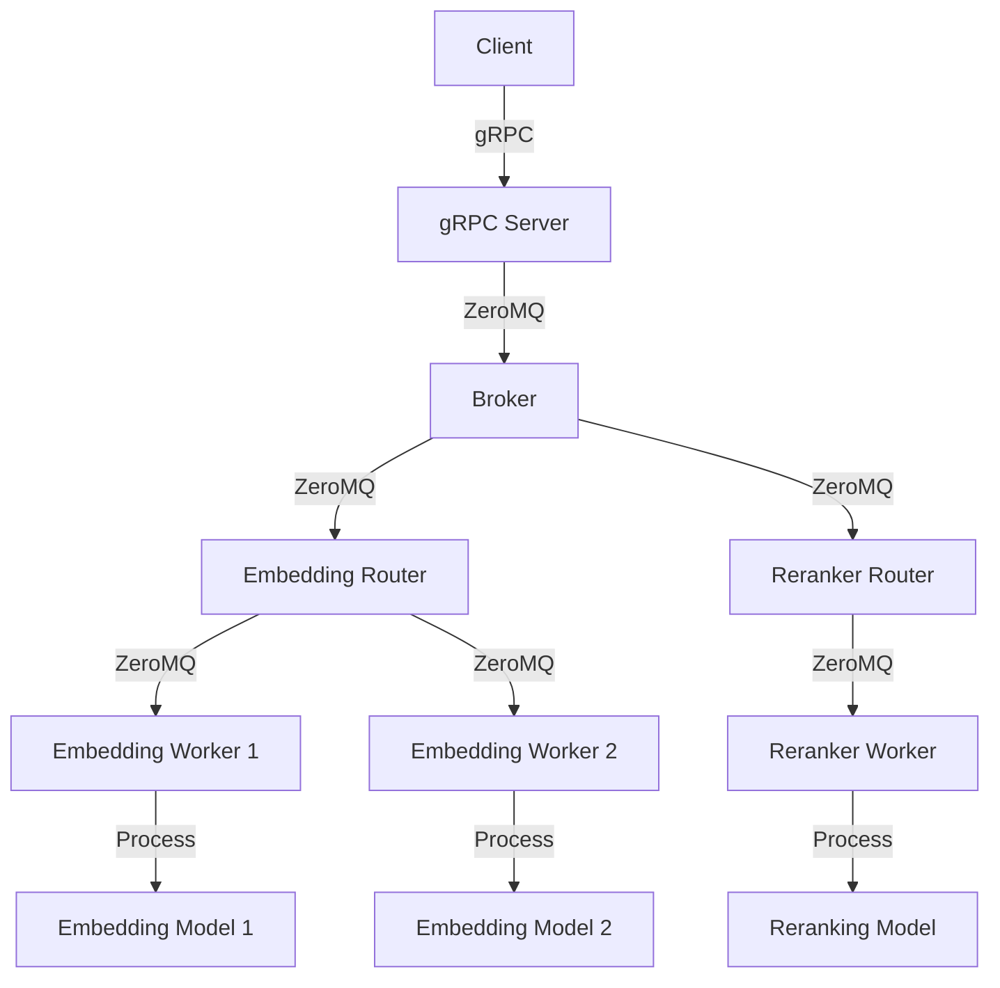

# Generic Vectorizer

Generic Vectorizer is a high-performance, distributed text embedding and reranking system built with Python, gRPC, and ZeroMQ. It provides efficient processing of text embedding and reranking tasks using state-of-the-art models.

## Table of Contents

- [Features](#features)
- [Architecture](#architecture)
- [Installation](#installation)
- [Usage](#usage)
- [Configuration](#configuration)
- [API Reference](#api-reference)
- [Contributing](#contributing)
- [License](#license)

## Features

- Distributed processing of text embedding and reranking tasks
- Support for multiple embedding and reranking models
- High-performance communication using gRPC and ZeroMQ
- Easy scaling of workers for different model types
- Configurable settings for fine-tuning performance
- Support for both dense and sparse embeddings
- Efficient chunking and aggregation of long texts

## Architecture

Generic Vectorizer consists of three main components: the gRPC server, the background workers, and the client. Here's a high-level overview of the architecture:



1. The client sends requests to the gRPC server.
2. The gRPC server forwards requests to the broker using ZeroMQ.
3. The broker distributes tasks to appropriate routers based on the task type.
4. Routers manage communication with multiple workers.
5. Workers process tasks using various models (embedding, reranking, etc.).
6. Results are sent back through the same path to the client.

This architecture allows for efficient distribution of work and easy scaling of workers for different model types.

## Installation

1. Clone the repository:

```bash
git clone https://github.com/yourusername/generic-vectorizer.git
cd generic-vectorizer
```

2. Install the required dependencies:

```bash
pip install -r requirements.txt
```

3. Compile the gRPC protobuf files:

```bash
./compile_grpc.sh
```

## Usage

### AsyncEmbeddingClient

The `AsyncEmbeddingClient` class provides the following methods:

- `get_embedding(text: str, embed_strategy: str, target_topic: str, chunk_size: int = 512, return_dense: bool = True, return_sparse: bool = False) -> Dict`
  
  Get the embedding for a single text.

- `get_batch_embedding(texts: List[str], embed_strategy: str, target_topic: str, chunk_size: int = 512, return_dense: bool = True, return_sparse: bool = False) -> List[Dict]`
  
  Get embeddings for a batch of texts.

- `get_rerank_scores(query: str, corpus: List[str], target_topic: str, normalize: bool = True) -> List[float]`
  
  Get rerank scores for a query and a list of documents.

Each method returns a dictionary or list of dictionaries containing the requested embeddings or scores.

For more detailed API information, including the structure of the request and response objects, please refer to the source code and comments in the `generic_vectorizer/client/client.py` file.

### Using the Generic Vectorizer Client

Here's a basic example of how to use the Generic Vectorizer client:

```python
import asyncio
from generic_vectorizer.client import AsyncEmbeddingClient

async def main():
    client = AsyncEmbeddingClient(grpc_server_address="localhost:1200")

    # Get embedding for a single text
    embedding = await client.get_embedding(
        text="Your text here",
        embed_strategy="BGE_M3_EMBEDDING_MODEL",
        target_topic='bge_m3',
        chunk_size=512,
        return_dense=True,
        return_sparse=True
    )
    print("Single text embedding:", embedding)

    # Get embeddings for a batch of texts
    batch_embeddings = await client.get_batch_embedding(
        texts=["Text 1", "Text 2", "Text 3"],
        embed_strategy="BGE_M3_EMBEDDING_MODEL",
        target_topic='bge_m3',
        chunk_size=512,
        return_dense=True,
        return_sparse=True
    )
    print("Batch embeddings:", batch_embeddings)

    # Get rerank scores
    rerank_scores = await client.get_rerank_scores(
        query="Your query here",
        corpus=["Document 1", "Document 2", "Document 3"],
        target_topic='bge_reranker',
        normalize=True
    )
    print("Rerank scores:", rerank_scores)

asyncio.run(main())
```

## Configuration of the server

Generic Vectorizer can be configured using the `EmbedderModelConfig` class. Here's an example configuration:

```python
from generic_vectorizer import Vectorizer
from generic_vectorizer.typing import EmbedderModelConfig, EmbedderModelType

embedder_model_configs = [
    EmbedderModelConfig(
        embedder_model_type=EmbedderModelType.BGE_M3_EMBEDDING_MODEL,
        target_topic='bge_m3',
        nb_instances=3,
        options={
            'model_name_or_path': 'BAAI/bge-m3',
            'device': 'cuda:0'
        }
    ),
    EmbedderModelConfig(
        embedder_model_type=EmbedderModelType.BGE_RERANKER_MODEL,
        target_topic='bge_reranker',
        nb_instances=1,
        options={
            'model_name_or_path': 'BAAI/bge-reranker-v2-m3',
            'device': 'cpu'
        },
        zmq_tcp_address='tcp://*:8500'
    )
]

vectorizer = Vectorizer(
    grpc_server_address='[::]:1200', 
    embedder_model_configs=embedder_model_configs,
    max_concurrent_requests=1024,
    request_timeout=30
)
vectorizer.listen()
```

## Launching the Server

Generic Vectorizer now supports configuration via a JSON file. This allows for easy customization of server settings and model configurations.

### Configuration File Structure

Create a `config.json` file with the following structure:

```json
{
  "grpc_server_address": "[::]:5000",
  "max_concurrent_requests": 1024,
  "request_timeout": 30,
  "embedder_model_configs": [
    {
      "embedder_model_type": "BGE_M3_EMBEDDING_MODEL",
      "target_topic": "bge_m3",
      "nb_instances": 3,
      "options": {
        "model_name_or_path": "BAAI/bge-m3",
        "device": "cuda:0"
      }
    },
    {
      "embedder_model_type": "BGE_RERANKER_MODEL",
      "target_topic": "bge_reranker",
      "nb_instances": 1,
      "options": {
        "model_name_or_path": "BAAI/bge-reranker-v2-m3",
        "device": "cpu"
      },
      "zmq_tcp_address": "tcp://*:8500"
    }
  ]
}
```

### Launching the Server

To launch the Generic Vectorizer server with your configuration:

```bash
python -m generic_vectorizer launch-engine --config path/to/your/config.json
```

This command will read the configuration from the specified JSON file and start the server with the provided settings.

## Contributing

Contributions are welcome! Please feel free to submit a Pull Request.

1. Fork the repository
2. Create your feature branch (`git checkout -b feature/AmazingFeature`)
3. Commit your changes (`git commit -m 'Add some AmazingFeature'`)
4. Push to the branch (`git push origin feature/AmazingFeature`)
5. Open a Pull Request

## License

This project is licensed under the MIT License - see the [LICENSE](LICENSE) file for details.