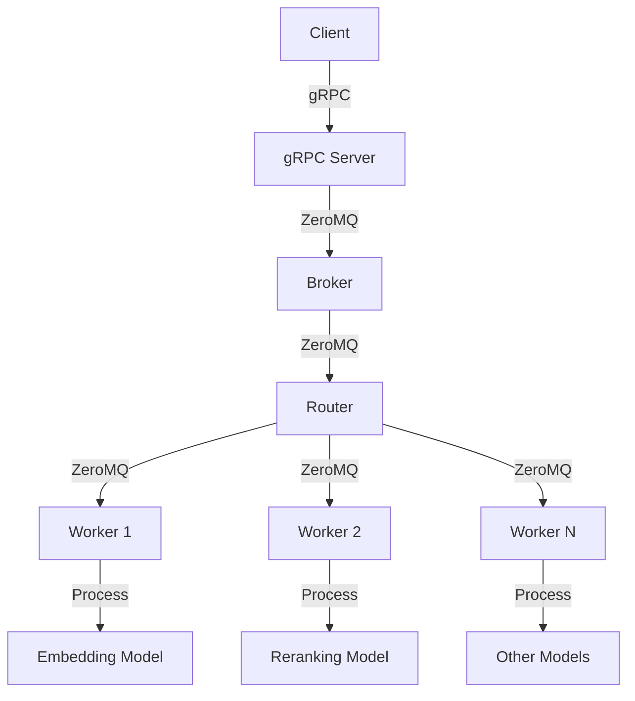

# QuickEmbed

QuickEmbed is a high-performance, distributed text embedding and reranking system built with Python, gRPC, and ZeroMQ. It provides efficient processing of text embedding and reranking tasks using state-of-the-art models.

## Table of Contents

- [Architecture](#architecture)
- [Features](#features)
- [Installation](#installation)
- [Usage](#usage)
- [Configuration](#configuration)
- [API Reference](#api-reference)
- [Contributing](#contributing)
- [License](#license)

## Architecture

The QuickEmbed system consists of three main components: the gRPC server, the background workers, and the client. Here's a high-level overview of the architecture:



1. The client sends requests to the gRPC server.
2. The gRPC server forwards requests to the broker using ZeroMQ.
3. The broker distributes tasks to appropriate routers based on the task type.
4. Routers manage communication with multiple workers.
5. Workers process tasks using various models (embedding, reranking, etc.).
6. Results are sent back through the same path to the client.

This architecture allows for efficient distribution of work and easy scaling of workers for different model types.

## Features

- Distributed processing of text embedding and reranking tasks
- Support for multiple embedding and reranking models
- High-performance communication using gRPC and ZeroMQ
- Easy scaling of workers for different model types
- Configurable settings for fine-tuning performance

## Installation

1. Clone the repository:

```bash
git clone https://github.com/yourusername/quick-embed.git
cd quick-embed
```

2. Install the required dependencies:

```bash
pip install -r requirements.txt
```

3. Compile the gRPC protobuf files:

```bash
./compile_grpc.sh
```

## Usage

1. Start the QuickEmbed server:

```bash
python -m quick_embed
```

2. In your application, use the QuickEmbed client to send requests:

```python
from quick_embed.client import QuickEmbedClient

client = QuickEmbedClient("localhost:50051")

# Get text embedding
embedding = client.get_text_embedding("Your text here")

# Get batch text embeddings
batch_embeddings = client.get_batch_text_embeddings(["Text 1", "Text 2", "Text 3"])

# Get rerank scores
rerank_scores = client.get_rerank_scores("Query", ["Document 1", "Document 2", "Document 3"])
```

## Configuration

QuickEmbed can be configured using the following files:

- `quick_embed/settings/app_settings.py`: General application settings
- `quick_embed/settings/grpc_server_settings.py`: gRPC server settings

You can modify these files to adjust the behavior of the system, such as changing the number of workers, model configurations, or communication settings.

## API Reference

### QuickEmbedClient

- `get_text_embedding(text: str) -> List[float]`
  Get the embedding for a single text.

- `get_batch_text_embeddings(texts: List[str]) -> List[List[float]]`
  Get embeddings for a batch of texts.

- `get_rerank_scores(query: str, documents: List[str]) -> List[float]`
  Get rerank scores for a query and a list of documents.

For more detailed API information, please refer to the source code and comments in the `quick_embed/client/client.py` file.

## Contributing

Contributions are welcome! Please feel free to submit a Pull Request.

1. Fork the repository
2. Create your feature branch (`git checkout -b feature/AmazingFeature`)
3. Commit your changes (`git commit -m 'Add some AmazingFeature'`)
4. Push to the branch (`git push origin feature/AmazingFeature`)
5. Open a Pull Request

## License

This project is licensed under the MIT License - see the [LICENSE](LICENSE) file for details.